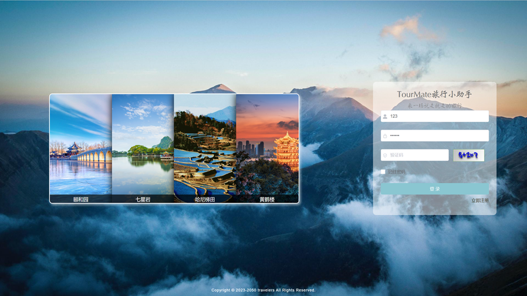
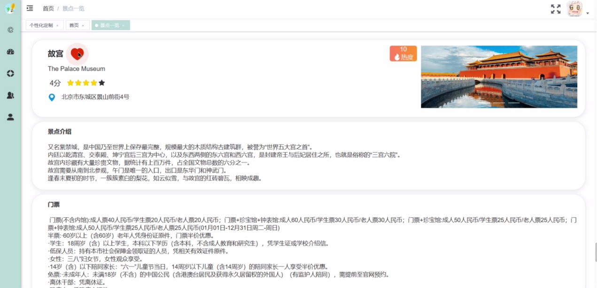
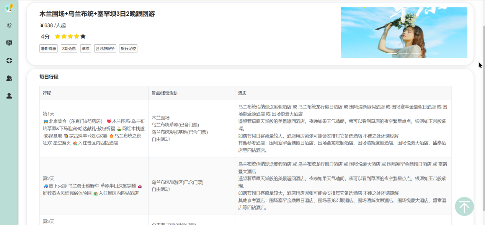
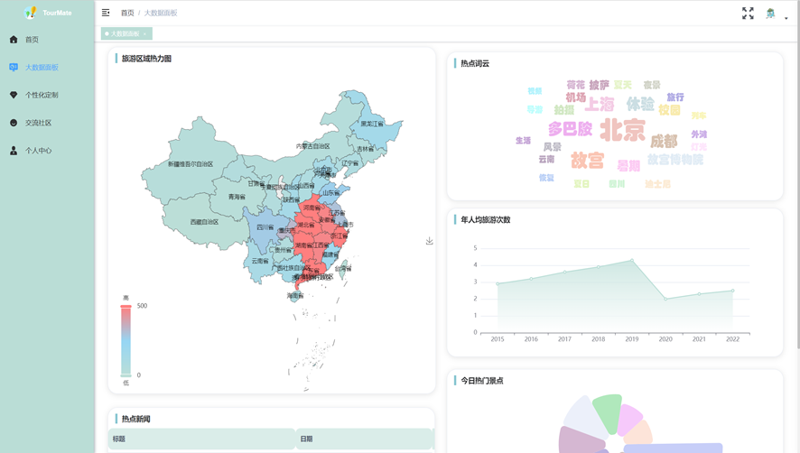
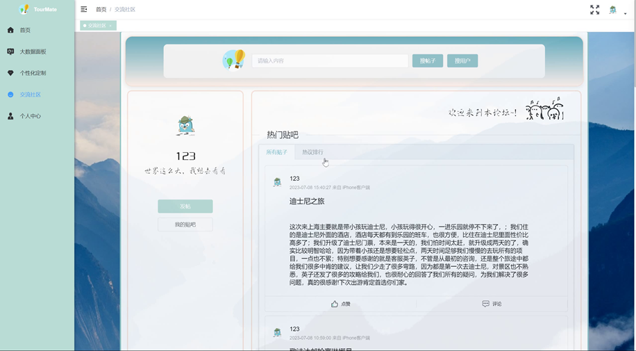
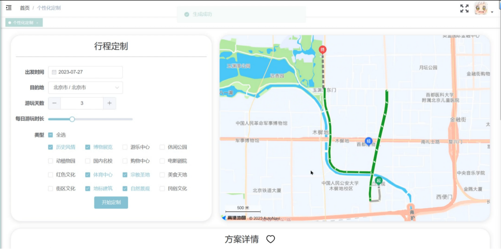
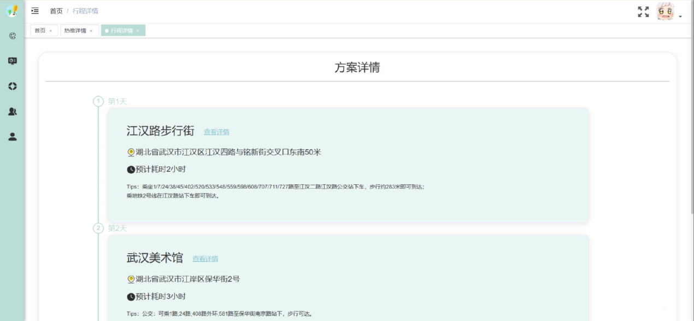

# Tourmate —— Data-Driven Tourism Service System

## Introduction
Tourmate is a comprehensive travel service platform powered by big data analytics to enhance travel experience. The system integrates sophisticated features for tourist attraction recommendations, personalized travel planning, and community interaction, all facilitated by an advanced microservice architecture.

## Features

### User Authentication
- **Login:** Users can log in by providing their username, password, and a captcha.
- **Registration:** New users can register by filling out a form with their details, which is then verified for successful account creation.

### Home Page
- **Attraction Search:** Users can search for attractions using keywords or filters.
- **Hotspot Recommendations:** Automatically curated seasonal popular attractions with details like reviews, images, and nearby dining options.

### Data Dashboard
- **Heatmaps:** Visual representation of popular tourist regions.
- **Top Attractions:** Rankings based on visitor data.
- **Keyword Clouds:** Displays current popular search terms.
- **News Feed:** Latest travel news fetched in real-time.
- **Tourist Statistics:** Displays tourist numbers for various regions.

### Personalized Travel Planning
- **Information Collection:** Users input their travel preferences and budgets.
- **Plan Generation:** Custom travel plans are generated using algorithms based on user input.
- **Plan Modification and Storage:** Users can modify and save these plans for future reference.

### Community Interaction
- **Posts:** Users can share experiences, ask questions, and interact through posts.
- **Likes and Comments:** Users can engage with community content through likes and comments.

### Personal Dashboard
- **Travel and Attraction Bookmarking:** Users can manage their saved travel plans and favorite attractions.
- **Profile Management:** Users can update their personal information.

## System Architecture

### Microservices - Ruoyi Framework
- **Service Discovery:** Utilizes Eureka for automatic service registration and discovery.
- **Configuration Management:** Centralized configuration using Nacos.
- **Load Balancing:** Load distribution with Ribbon or Nginx.
- **Resilience:** Fault tolerance with Hystrix, including circuit breaker patterns.
- **API Gateway:** Route management and security with Zuul or Gateway.
- **Monitoring:** Service health and performance monitoring with Zipkin, SkyWalking, or Prometheus.

### [Frontend Architecture]( https://github.com/QianhuiL1/Tourmate_frontend.git)
- **Vue.js Integration:** Frontend development with integration of AMap API, Element UI, and Echarts for a responsive user interface.

### [Backend Design]( https://github.com/QianhuiL1/Tourmate_backend.git)
- **Framework:** SSM (Spring MVC, Spring, MyBatis)
- **Layers:** Separation into controller, service, and DAO layers for efficient management and operation.

### Algorithm Design
- **Recommendation System:** Utilizes a neural network model for personalized attraction recommendations.
- **Travel Planning Algorithm:** Uses ant colony optimization for efficient route planning.

## Page Layout Diagram

<table>
    <tr>
        <td></td>
        <td></td>
    </tr>
    <tr>
        <td></td>
        <td></td>
    </tr>
    <tr>
        <td></td>
        <td></td>
    </tr>
	<tr>
        <td></td>
        <td></td>
    </tr>	 
    <tr>
        <td></td>
        <td></td>
    </tr>	
</table>

## Getting Started

### Prerequisites
- Node.js 10+

### Installation
```bash
# Clone the repository
git clone https://github.com/yourgithub/tourmate.git

# Navigate to the project directory
cd tourmate

# Install dependencies
npm install

# Run the application
npm run dev
```
